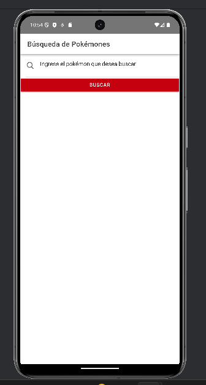
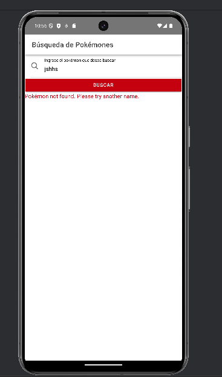
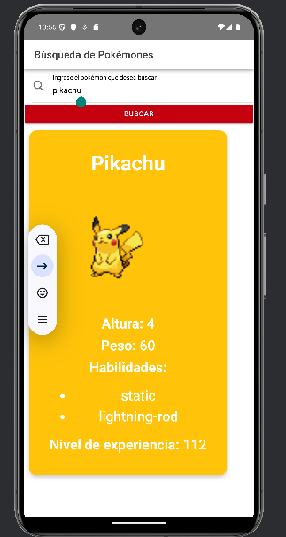

# BÚSQUEDA DE POKEMONES
Es una aplicación que meidnante el uso de  una API pública se obtiene todos los pokemones existentes en el mundo.

**Búsqueda de Pokémones r** perimite a los usuarios realizar una búsqueda exhaustiva de su pokémon favorito.

## Captura de la aplicación

## Autor
Esta implementación  fue creado por  Erick Caiza.